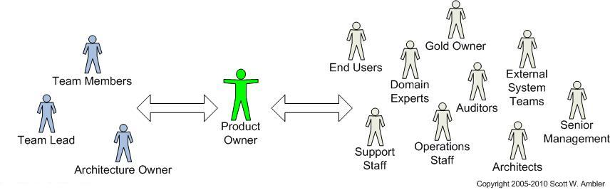

# Product Owner

## What is a Product Owner?

The Product Owner is a specific one-person role within the Scrum framework, which may be provided by the client or sit within the agency. As the product lead with your charity, you are predestined to act as a PO due to your business know-how and corporate authority.

## Responsibilities of a Product Owner

According to the SCRUM documentation, the product owner has three primary responsibilities:

### **1. Maximising the delivered value**

To this end, the PO must:

* know the business 
* have a vision of the product 
* be able to define the elements that create value
* be able to prioritise these elements according to this rule: 

> **first \(as far as dependencies allow\) the elements of maximum Value at least Cost.**

### 2. Managing the Product Backlog

The PO must ensure that a Product Backlog exists and is always up to date. The task of writing the Product Backlog can be delegated but the PO must participate in its definition and description. The PO must guide the people who write the Product Backlog.

The Product Backlog is a list of everything that is known to be needed in the product. It is the single **source of requirements** for any changes to be made to the product.

The Product Backlog:

* is **dynamic;** it constantly changes to identify what the product needs to be appropriate, competitive and useful. 
* sits **outside the sprint loop** \(meaning it contains work that will not be completed during the current sprint\) but informs how your sprint will be planned 
* is composed of feedback from **the development team, customer** and **stakeholders**
* contains **features, functions, requirements, enhancements** and **fixes**

Steps when creating a Product Backlog: 

1. **Add ideas to the backlog** **\(**based on feedback from dev team, customers, stakeholders\) 
2. **Get clarification** - ensure you understand the reason behind the item, the value it adds and any specifications of the item, such as [story points](glossary.md#story-point). 
3. **Prioritise** - clearly define, high-priority items should be at the top
4. **Update backlog regularly** and add top items to the next sprint cycle. 

TIP: Color-code each block to indicate an item is sufficiently refined and ready for sprint planning 

Prioritisation

* **Higher-priority items** should be refined and have great value to the product.
* **Mid-priority items** should be candidates for refinement \(the process of detailing each task\)
* **Low-priority items** should not be a dependency and can be safely ignored until they are candidates for refinement.

### 3. Leading & attending regular sprint events

The PO is responsible for leading the Sprint Planning and Sprint Reviews as well as attending the Sprint Retrospective. 



Sprint Planning is a regular event in the Scrum framework where the team determines the product backlog items they will work on during that sprint and discusses their initial plan for completing those product backlog items.

Sprint Planning answers the following:

* What can be delivered in the Increment resulting from the upcoming Sprint?
* How will the work needed to deliver the Increment be achieved?

During this meeting, the PO: 

* proposes a [Sprint Goal](glossary.md#sprint-goal) and defines Product Backlog items that will allow reaching this goal
* should help the dev team understand the Product Backlog items
* must be willing to negotiate the extend of the Sprint if it exceeds the team's capacity



Sprint Review is an informal meeting at the end of each sprint.  During this meeting, the Scrum team shows what they accomplished during the sprint \(usually in form of a product demo\) and the project is assessed against the sprint goal determined during the sprint planning meeting. The result of the Sprint Review is a revised Product Backlog that defines the probable Product Backlog items for the next Sprint

Attendees: 

* Scrum Team 
* Key Stakeholders invited by PO 

The Sprint Review includes the following elements:

* PO explains what Product Backlog items have been “Done” and what has not been “Done”;
* Dev Team discusses what went well during the Sprint, what problems it ran into, and how those problems were solved;
* Dev Team demonstrates the work that it has “Done” and answers questions about the Increment;
* PO discusses the Product Backlog as it stands. He or she projects likely target and delivery dates based on progress to date \(if needed\);
* The entire group collaborates on what to do next, so that the Sprint Review provides valuable input to subsequent Sprint Planning 
* Review of how the marketplace or potential use of the product might have changed what is the most valuable thing to do next; and,
* Review of the timeline, budget, potential capabilities, and marketplace for the next anticipated releases of functionality and capability of the product.



The Sprint Retrospective is a meeting for the Scrum Team to inspect itself and create a plan for improvements to be enacted during the next Sprint. It occurs after the Sprint Review and prior to the next [Sprint Planning](glossary.md#sprint-planning). By the end of the Sprint Retrospective, the Scrum Team should have identified improvements that it will implement in the next Sprint.

During the Sprint Retrospective, the team discusses:

* What went well in the Sprint?
* What could be improved?
* What will we commit to improve in the next Sprint?



> The sprint review looks at **what** the team is building, whereas the retrospective looks at **how** they are building it.

## Position of a Product Owner 

The PO mediates between the development team and the stakeholders. In Scrum, a stakeholder is anyone with a vested interest in the product who is not part of the Scrum Team.

The PO represents stakeholders to dev team by: 

* providing timely information and decisions on requirements and priority
* being an active participant in customer testing
* facilitating requirements gathering

The PO represents dev team to stakeholders by: 

* demonstrating the solution to key stakeholders 
* announcing releases 
* communicating the team status
* negotiating priorities, scope and schedule 
* working closely with the [Scrum Master](glossary.md#scrum-master)

## Tasks of a Product Owner

