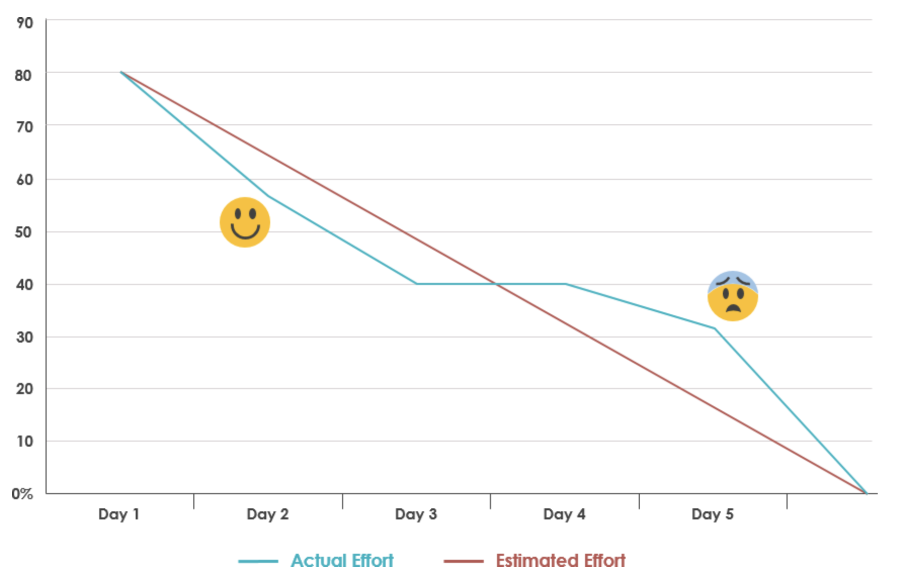

# The Burndown Chart

A burndown chart is a graphical representation of work left to do versus time. The Scrum Burndown Chart is a visual measurement tool that shows the completed work per day against the projected rate of completion for the current project release.

### Why?

The burndown chart is a useful tool to help the PO and the team identify how much of the product can be delivered at any one time. 

A burndown chart is almost a “must” have tool for a Scrum team for the following main reasons:

* monitoring the project scope creep
* Keeping the team running on schedule
* Comparing the planned work against the team progression

It should be a regular part of Scrum meetings.

### How?

The burndown chart is usually based on [velocity](../../glossary.md#velocity) and [story points](../../glossary.md#story-points).  Only stories that are **complete** may count towards the “burn”. 

It tracks values along two axis:  

* **vertical axis:** represents the outstanding work 
* **horizontal axis:** represents the time or sprints

To create this graph, determine how much work remains by summing the Sprint Backlog estimates \(i.e. story points\) every day of the Sprint. The amount of work remaining for a Sprint is the sum of the work remaining for the whole Sprint Backlog. Keep track of these sums by day and use them to create a graph that shows the work remaining over time.

#### Steps for creating a burndown chart 

#### \*\*\*\*

\*\*\*\*

